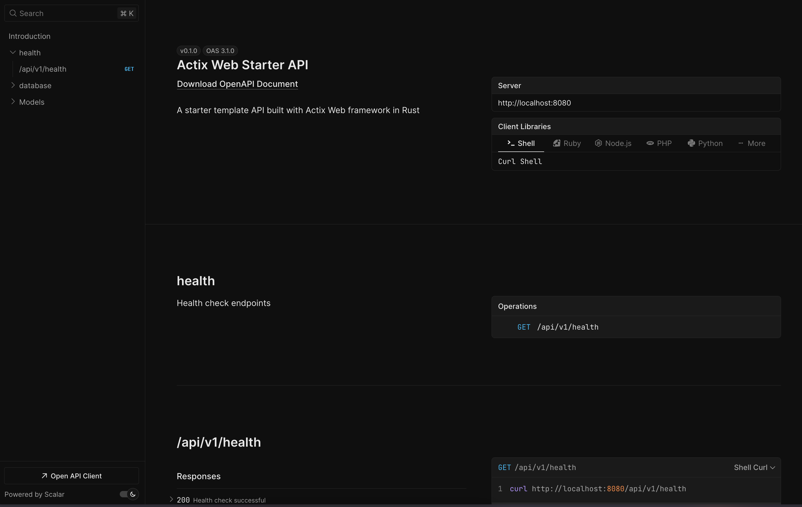

# Actix Web Starter

A starter template for building web applications with Actix Web framework in Rust.




*Interactive API documentation powered by Scalar*

## Features

- **Fast and lightweight web server** built with Actix Web
- **OpenAPI/Swagger documentation** with interactive Scalar UI
- **SQLite database** integration with SQLx and automatic migrations
- **Error handling** with color-eyre for better debugging
- **Health check endpoints** for monitoring
- **Static file serving** with file listing support
- **Comprehensive logging** with env_logger
- **Hot reload development** with bacon
- **Docker support** with multi-stage builds and health checks
- **GitHub Actions CI/CD** with Docker image publishing
- **Git hooks** with lefthook for code quality enforcement
- **Development tooling** with just recipes and comprehensive testing

## Prerequisites

- Rust (latest stable version)
- Cargo package manager
- SQLite (for local development)
- Docker (optional, for containerization)
- Lefthook (optional, for git hooks)

## Getting Started

1. Clone this repository:
```bash
git clone https://github.com/Mozart409/actix_web_starter.git
cd actix_web_starter
```

2. Set up environment variables:
```bash
cp .env.example .env
# Edit .env with your configuration
```

3. Run the application:
```bash
# Using cargo
cargo run

# Using just (recommended for development)
just

# Using bacon for hot reload
bacon run
```

4. Open your browser and navigate to `http://localhost:8080`
   - View the API documentation at `http://localhost:8080/scalar`
   - Access the raw OpenAPI spec at `http://localhost:8080/api-docs/openapi.json`

## Project Structure

```
actix_web_starter/
├── src/
│   ├── api.rs              # API handlers, routing, and OpenAPI schemas
│   ├── db.rs              # Database connection and setup
│   ├── lib.rs             # Library exports and OpenAPI documentation
│   └── main.rs            # Application entry point
├── migrations/            # SQLx database migrations
│   ├── 20250708091103_init.up.sql
│   └── 20250708091103_init.down.sql
├── static/                # Static assets (served at /static)
├── .github/workflows/     # GitHub Actions CI/CD
│   └── docker-publish.yml
├── build.rs              # SQLx build script
├── lefthook.yml          # Git hooks configuration
├── justfile              # Development commands
├── bacon.toml            # Bacon configuration
├── Dockerfile            # Multi-stage Docker build
├── docker-bake.hcl       # Docker Bake configuration
├── .env.example          # Environment variables template
├── Cargo.toml            # Dependencies and metadata
└── README.md
```

## API Endpoints

- `GET /` - Root endpoint (serves static files)
- `GET /favicon.ico` - Favicon handler
- `GET /scalar` - Interactive API documentation (Scalar UI)
- `GET /api-docs/openapi.json` - OpenAPI specification in JSON format
- `GET /api/v1/health` - Health check endpoint
- `POST /api/v1/db-demo` - Database demo endpoint
- `GET /static/*` - Static file serving with directory listing

### API Documentation

The API is fully documented using OpenAPI 3.0 specifications. You can access the interactive documentation at:
- **Scalar UI**: `http://localhost:8080/scalar` - Modern, interactive API documentation
- **OpenAPI JSON**: `http://localhost:8080/api-docs/openapi.json` - Raw OpenAPI specification

All API endpoints include proper request/response schemas, error handling, and comprehensive documentation.

## Development

### Using Just (Recommended)
```bash
just          # Run the development server with hot reload
just check    # Run cargo check
just clear    # Clear the terminal
```

### Using Bacon
```bash
bacon run     # Run with hot reload
bacon check   # Check compilation
bacon clippy  # Run clippy lints
bacon test    # Run tests
```

### Using Cargo
```bash
cargo run                    # Run the application
cargo test                   # Run tests
cargo build --release        # Build for production
cargo clippy                 # Run linter
cargo fmt                    # Format code
```

## Configuration

The application uses environment variables for configuration. Copy `.env.example` to `.env` and modify:

```bash
DATABASE_URL=sqlite://project.db
RUST_LOG=actix_web=info,actix_server=info,db=info
RUST_BACKTRACE=0
```

## Database

The project uses SQLite with SQLx for database operations:

- **Migrations**: Located in `migrations/` directory
- **Auto-migration**: Runs automatically on startup
- **Connection pooling**: Configured with a maximum of 5 connections
- **WAL mode**: Enabled for better concurrent performance

## Key Dependencies

- **actix-web**: Fast and powerful web framework
- **sqlx**: Async SQL toolkit with compile-time verification
- **utoipa**: OpenAPI code generation and documentation
- **utoipa-scalar**: Modern API documentation UI
- **color-eyre**: Enhanced error handling and reporting
- **serde**: Serialization/deserialization framework
- **chrono**: Date and time handling
- **tokio**: Async runtime

## Docker

### Local Development
```bash
docker build -t actix_web_starter .
docker run -p 8080:8080 actix_web_starter
```

### Using Docker Bake
```bash
docker buildx bake
docker buildx bake image-all  # Build for multiple platforms
```

### Production Deployment
The Docker image is optimized for production with:
- Multi-stage builds for smaller image size
- Health checks built-in
- Non-root user execution
- Support for multiple architectures (amd64, arm64, armv6, armv7)

## Testing

Run the comprehensive test suite:
```bash
cargo test
```

The project includes:
- Unit tests for individual components
- Integration tests for API endpoints
- Database tests with in-memory SQLite
- Error handling tests
- Custom error type tests with proper HTTP responses

### Git Hooks

The project uses `lefthook` for automated code quality checks:
- **Clippy linting** - Catches common mistakes and suggests improvements
- **Code formatting** - Ensures consistent code style with `cargo fmt`
- **Test execution** - Runs all tests to ensure functionality
- **Release builds** - Verifies the project builds in release mode

Install lefthook to enable pre-commit hooks:
```bash
# Install lefthook
brew install lefthook  # macOS
# or
sudo apt install lefthook  # Ubuntu/Debian

# Install hooks
lefthook install
```

## CI/CD

GitHub Actions workflow automatically:
- Builds and tests the application
- Creates Docker images for multiple platforms
- Publishes to GitHub Container Registry
- Signs images with cosign for security